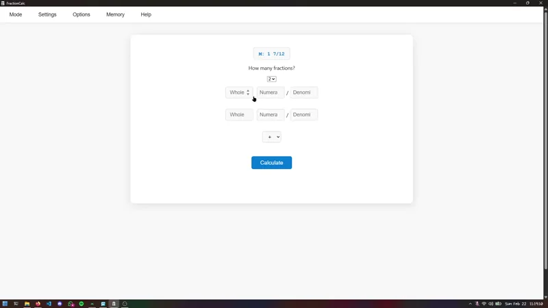

# 📐 FractionCalc

> A lightweight, cross‑platform fraction calculator — built by students, for students. 100% free & open source.

---

## ✨ About
FractionCalc is an ad‑free, open‑source calculator designed to make working with fractions simple and fun.  
We built this to help **middle‑school students (and teachers!)** who need a fast, offline tool that *just works* — even on older PCs.

💡 Why waste time scribbling on paper when you can calculate fractions instantly?

## 📸 Demo

Here’s FractionCalc in action 👇

---

## ✅ Features
- 🌙 **Dark/Light Mode** toggle
- ➗ **Fraction ↔ Decimal conversions**
- 🔄 **Complex → Simple fractions** reducer
- 🧮 **Operate up to 10 fractions at once**
- 🎨 **Personalization options** (wallpapers & themes)
- 📱 Available on **Windows, Linux, and Android**

---

## 🚀 Why FractionCalc?
- ⚡ **Lightweight**: its very light and fast, thanks to Tauri framework
- 🎓 **Made for students**: no ads, no distractions, just learning.

---

## 🤝 Contributing
Want to contribute?

1. Fork this repo
2. Clone your fork
3. Make your changes
4. Open an issue / pull request
5. Thats it, youre done.

---

## ⭐ Support
If FractionCalc helps you, please **star this repo** 🌟 — it motivates us a lot!

---

## ⚖️ License
Licensed under the **GNU GPL‑v3 License**.  
If you share or modify, please give proper credits 🙏.

---

## 📢 Credits
This project was started by two middle‑school friends who just wanted a better calculator for class ✨

> Built with ❤️ by Ashyraffa

---

> More Credits [here.](CREDITS.md)
